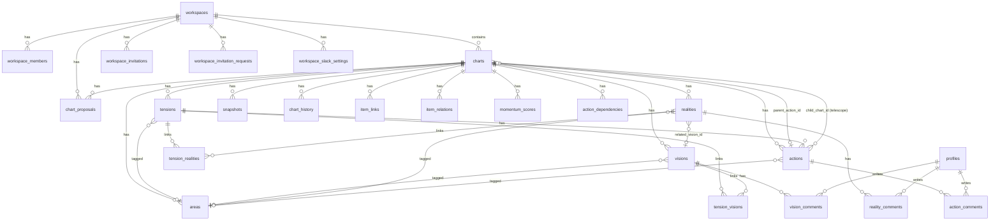

## TODO（優先）
- [ ] `npm audit fix` を実行してビルド確認する（High脆弱性 3件: undici関連）

# ZENSHIN CHART — Claude Code ガイド

> 「緊張構造で前進を生み出すプラットフォーム」
> Robert Fritz の「構造的テンション」理論に基づく思考・創造活動支援SaaS

---

## Single Source of Truth

Kazに関する正規情報と不変のルールは `~/brain-bot/` を参照してください。
各セッション開始時に以下の読み込みを推奨します:

- `~/brain-bot/profile/KAZ.md` — Kaz本人のプロファイル
- `~/brain-bot/AGENTS.md` — Skill Resolver（3層構造）
- `~/brain-bot/skills/ARCHITECTURE.md` — atoms/molecules/compounds 定義
- `~/brain-bot/skills/atoms/claude-collab-protocol/SKILL.md` — Claude協働9ルール
- `~/brain-bot/skills/atoms/fritz-terminology/SKILL.md` — Fritz用語統一
- `~/brain-bot/skills/atoms/fritz-chart-principles/SKILL.md` — V/R/T/A 記述原則
- `~/brain-bot/skills/atoms/clickup-workspace-map/SKILL.md` — ClickUp構造
- `~/brain-bot/skills/atoms/time-awareness/SKILL.md` — 時刻認識プロトコル
- `~/brain-bot/skills/atoms/skillify/SKILL.md` — 10ステップskillifyプロトコル
- `~/brain-bot/skills/atoms/cost-guard/SKILL.md` — LLMコスト暴走防止

Kazが「skillifyして」「skill化して」「恒久化して」と言ったら
atoms/skillify/ の10ステップを発動してください。

このCLAUDE.mdには **zenshin-chart 固有の情報のみ** を記載します。
Fritz用語・V/R/T/A の一般原則・ClickUp構造・協働ルール等は brain-bot SSoT を参照してください。

---

## 開発環境

このプロジェクトはM5 MacBook Air（クラムシェルモード）上にある。
Kazは M1 Pro の Cursor から Remote SSH: brain-bot で接続して開発する。

- **Dev server**: `npx next dev --hostname 0.0.0.0`（ポート3000）
- **確認URL**: http://100.124.87.5:3000（M1 Proブラウザから）
- **⚠️ `npm run dev` だけだとlocalhostにバインドされ外部アクセス不可。必ず `--hostname 0.0.0.0` をつける**
- **GitHub**: kazooligan1982/zenshin-web
- **デプロイ**: GitHub → Vercel（自動）
  - 本番URL: zenshin-web-alpha.vercel.app（カスタムドメイン: zenshinchart.com）
  - Preview URL: `zenshin-web-<branch>-<hash>.vercel.app`（Vercel自動命名）
- **Supabase project ID**: `wglutqoufuvnzmkruewg`
- **ブランチ保護**: main への直接コミット禁止。develop からのマージのみ
- **.env**: `.env.local` が必要（GitHubに上がらない）
- **Vercel Cron**: `vercel.json` で設定済み
  - slack-summary: 毎日 JST 9:00
  - slack-weekly: 毎週月曜 JST 9:00
  - 認証ヘッダー: `Authorization: Bearer $CRON_SECRET`（値は .env.local / Vercel 環境変数を参照）
  - テスト: `curl -H "Authorization: Bearer $CRON_SECRET" https://zenshin-web-alpha.vercel.app/api/cron/slack-summary`

---

## ブランチ戦略

| ブランチ | 役割 | デプロイ先 |
|----------|------|-----------|
| `main` | 本番ブランチ。直接コミット禁止。develop からのマージのみ | Vercel Production（zenshinchart.com） |
| `develop` | 開発ブランチ。日常の開発はここで行う | Vercel Preview（自動プレビューURL） |
| `feature/xxx` | 大きな機能開発時に develop から切る（任意） | Vercel Preview |

### ワークフロー

1. 日常の開発は `develop` で行う
2. Vercel Preview URL で動作確認
3. 確認OK なら `develop` → `main` にマージ（PR経由）
4. `main` へのマージ = 本番デプロイ

### Claude Code 使用時のルール

- **作業ブランチは常に `develop`**（または develop から切った feature ブランチ）
- `main` に直接コミット・プッシュしないこと
- コミット前に `git branch` で現在のブランチを確認すること

---

## 技術スタック

| 項目 | 技術 |
|------|------|
| フレームワーク | Next.js 15 (App Router) |
| DB | Supabase + RLS |
| ホスティング | Vercel |
| CSS | Tailwind v4 |
| UI | shadcn/ui |
| i18n | next-intl (ja/en) |
| リッチテキスト | Tiptap |
| トースト | sonner |
| D&D | dnd-kit |
| テスト | Vitest + Playwright + GitHub Actions |

---

## ★★★ 絶対ルール（これを破ると壊れる）

### 1. 正規ルートは `app/workspaces/[wsId]/charts/[id]/`

- チャート関連の全てのコンポーネント・フック・Server Actionは `app/workspaces/[wsId]/charts/[id]/` に集約済み
- `app/charts/` 配下はリダイレクト専用ページのみ（`/charts/[id]` → `/workspaces/{wsId}/charts/{id}` に自動転送）
- マイワークスペースも通常のWSとして `workspace_id` を持つため、全ユーザーが `/workspaces/[wsId]/` 経由でアクセスする
- 共有コンポーネント: `components/charts/`（chart-card, new-chart-button等）
- チャート一覧actions: `lib/charts-actions.ts`（createChart, getChartsHierarchy等）

### 2. VRTA カラー（厳守）

| 概念 | Tailwind class | 用途 |
|------|----------------|------|
| Vision | `emerald` | 理想の状態 |
| Reality | `orange` | 現在の状態 |
| Tension | `sky` | V と R のギャップ |
| Action | `slate` | 具体的な行動 |

この4色対応は zenshin-chart UI の不変ルール。`bg-emerald-*` / `text-orange-*` 等のクラスを横断的に使用しており、変更すると UI 全体の整合性が崩れる。

Fritz原則（Vision→Reality→Tension→Action の順序、構造緊張、start with nothing 等）の詳細は brain-bot SSoT (`~/brain-bot/skills/atoms/fritz-terminology/`, `fritz-chart-principles/`) を参照。

### 3. V/R/T/A の2層構造（zenshin-chart 実装固有）

`visions` / `realities` / `tensions` / `actions` テーブルは以下の2カラムを持つ:

- **`content` / `title`** — 短い要約（一覧表示・カード表示用）
- **`description`** — 詳細文（Tiptap/Markdown ネイティブ、モーダル内で編集）

UI 上はカードに `content` を、モーダル内の本文に `description` を表示する。
この2層構造は **AI Coach がコンテキストとして両方を読む前提** で設計されている。

### 4. Cursor/Claude Code 使用時の注意

- **Cursor が `toast.success(...)` を `toast.success\`...\`` に書き換えることがある** → 修正後必ず確認
- **同様に `revalidatePath(...)` も壊れやすい** → 修正後必ず確認
- 確認: `grep -n 'toast\.success' file | grep -v 'toast\.success('`
- 巨大ファイルでの修正は暴走リスク高 → 影響範囲を限定して指示する
- **「これだけ修正してください。他は変更しないでください。」と必ず付ける**

---

## コア概念モデル

```
Vision（理想）──┐
                ├──→ Tension（ギャップ）──→ Action（行動）
Reality（現実）─┘
```

- Vision/Reality の間に Tension が生まれる
- Tension にタグ（Area）が紐づく
- Action は Tension 配下に属する
- Action のタグは Tension から継承（Action個別のタグ変更は不要）
- Action はテレスコープで子チャート化可能（子チャート完了→親Action自動完了）

### ステータス

- **Chart.status**: `"active" | "completed"`
- **TensionStatus**: `"active" | "review_needed" | "resolved"`
- **ActionPlan.status**: `"todo" | "in_progress" | "done" | "pending" | "canceled"`

---

## 画面構成

### システム全体像

```
Editor（創造）→ Views（実行）→ Snapshot（観測）
                    ↓
            HOME / Dashboard（俯瞰）
                    ↓
              AI Coach（伴走）
```

| 機能 | 役割 | 状態 |
|------|------|------|
| Editor | V/R/T/Aを描く | ✅ 実装済み |
| Views (カンバン) | ステータス別Action管理 | ✅ 実装済み |
| Views (ツリー) | 階層構造可視化 | ✅ 実装済み |
| Snapshot | 手動取得・比較・保存 | ✅ Phase 1+2 完了 |
| Comparison AI | AI差分分析 + 履歴リデザイン | ✅ 完了 |
| Slack統合 | 日次サマリー・週次レポート | ✅ 完了 |
| Workspace設定 | General設定ページ | ✅ 完了 |
| Audit Logs | 監査ログ + Workspaceロール | ✅ テーブル作成済み |
| i18n | 日英対応（next-intl） | ✅ 基盤完了 |
| Dashboard | モメンタム指標・期間フィルタ | 🔜 未実装 |
| AI Coach | Fritz教えベースのコーチング | 🔜 未実装 |
| Onboarding | 初回ユーザーガイド | 🔜 未実装 |

### 対比モード（Comparison View）

V/R をタグ（Area）ごとに横並びで表示。上部: V/R対比（編集可能）、下部: T&A（フルwidth）。

### 統一モーダル設計（Unified Modal）

Action編集等のモーダルUIは統一設計済み。Phase 1〜3で段階的に実装。
詳細は `UNIFIED-MODAL-DESIGN.md` および `UNIFIED-MODAL-PHASE1.md` / `PHASE2.md` / `PHASE2-FIX.md` を参照。

---

## ファイル構成（主要）

```
app/
├── charts/
│   ├── page.tsx                    # リダイレクト → /workspaces/{wsId}/charts
│   └── [id]/
│       ├── page.tsx                # リダイレクト → /workspaces/{wsId}/charts/{id}
│       ├── kanban/page.tsx         # リダイレクト → /workspaces/{wsId}/charts/{id}/kanban
│       ├── dashboard/page.tsx      # リダイレクト → /workspaces/{wsId}/charts/{id}/dashboard
│       └── snapshots/page.tsx      # リダイレクト → /workspaces/{wsId}/charts/{id}/snapshots
├── workspaces/
│   └── [wsId]/
│       ├── charts/[id]/            # ★ 正規ルート（全コンポーネント集約）
│       │   ├── page.tsx            # チャート詳細
│       │   ├── project-editor.tsx  # メインエディタ
│       │   ├── actions.ts          # Server Actions（VRTA CRUD）
│       │   ├── components/         # ActionSection, SortableItems等
│       │   ├── hooks/              # useActionHandlers, useDndHandlers等
│       │   ├── kanban/             # カンバン・ツリービュー
│       │   ├── dashboard/          # ダッシュボード・スナップショット
│       │   └── snapshots/
│       ├── dashboard/
│       │   ├── page.tsx
│       │   ├── momentum-score-card.tsx   # 前進スコアカード
│       │   └── momentum-trend-chart.tsx  # 前進スコア推移グラフ
│       └── settings/
│           ├── page.tsx
│           ├── general/            # Workspace一般設定
│           ├── members/
│           └── archive/
├── api/
│   ├── cron/slack-summary/         # 日次Slackサマリー（JST 9:00）
│   └── cron/slack-weekly/          # 週次Slackレポート（月曜JST 9:00）
components/
├── charts/                         # 共有チャートコンポーネント
│   ├── chart-card.tsx
│   ├── new-chart-button.tsx
│   ├── completed-charts-section.tsx
│   └── delete-chart-button.tsx
├── action-timeline/
├── tag/TagManager.tsx
├── locale-switcher.tsx
├── sidebar.tsx
├── ui/
lib/
├── charts-actions.ts               # チャート一覧actions（createChart, getChartsHierarchy等）
├── supabase/queries.ts             # DB取得・更新（server createClient() 統一済み）
├── momentum-score.ts               # モメンタムスコア計算
├── permissions.ts                  # ロール別権限ヘルパー
├── workspace-search.ts
├── locale.ts                       # 言語判定
messages/
├── ja.json                         # 日本語翻訳
├── en.json                         # 英語翻訳
i18n/
├── config.ts                       # locales定義
├── request.ts                      # next-intl設定
docs/
├── PRODUCT-VISION.md               # プロダクトビジョン（思想面の詳細）
├── HANDOFF.md                      # 開発引き継ぎ（※2026-02-14時点、古い）
├── I18N-HANDOFF.md                 # i18n実装ガイド
├── MULTI-WORKSPACE-CONSULTANT-DESIGN.md  # マルチWSコンサルタント設計
UNIFIED-MODAL-DESIGN.md             # 統一モーダル設計書
UNIFIED-MODAL-PHASE1.md             # 統一モーダル Phase 1
UNIFIED-MODAL-PHASE2.md             # 統一モーダル Phase 2
UNIFIED-MODAL-PHASE2-FIX.md         # 統一モーダル Phase 2 修正
```

---

## データベース（Supabase）

### ER図（Mermaid）



### テーブル詳細（カラム一覧）

#### コアテーブル

**workspaces** (35行)
| カラム | 型 | NULL | デフォルト | 備考 |
|--------|-----|------|-----------|------|
| id | uuid | NO | uuid_generate_v4() | PK |
| name | text | NO | | |
| owner_id | uuid | NO | | FK → auth.users |
| created_at | timestamptz | NO | now() | |
| updated_at | timestamptz | NO | now() | |
| slack_notify | bool | NO | false | |
| is_personal | bool | NO | false | |

**workspace_members** (47行)
| カラム | 型 | NULL | デフォルト | 備考 |
|--------|-----|------|-----------|------|
| id | uuid | NO | uuid_generate_v4() | PK |
| workspace_id | uuid | NO | | FK → workspaces |
| user_id | uuid | NO | | FK → auth.users |
| role | text | NO | 'owner' | CHECK: owner/consultant/editor/viewer |
| created_at | timestamptz | NO | now() | |

**charts** (132行)
| カラム | 型 | NULL | デフォルト | 備考 |
|--------|-----|------|-----------|------|
| id | uuid | NO | gen_random_uuid() | PK |
| title | text | NO | | |
| parent_action_id | uuid | YES | | FK → actions (テレスコープ) |
| created_at | timestamptz | YES | now() | |
| updated_at | timestamptz | YES | now() | |
| description | text | YES | | |
| due_date | timestamptz | YES | | |
| archived_at | timestamptz | YES | | |
| user_id | uuid | YES | | FK → auth.users |
| workspace_id | uuid | YES | | FK → workspaces |
| status | text | YES | 'active' | 'active' / 'completed' |

**visions** (215行)
| カラム | 型 | NULL | デフォルト | 備考 |
|--------|-----|------|-----------|------|
| id | uuid | NO | gen_random_uuid() | PK |
| chart_id | uuid | YES | | FK → charts |
| content | text | NO | | |
| target_date | timestamptz | YES | | |
| created_at | timestamptz | YES | now() | |
| updated_at | timestamptz | YES | now() | |
| is_locked | bool | YES | false | |
| assignee | text | YES | | |
| sort_order | float8 | YES | 0 | |
| area_id | uuid | YES | | FK → areas |
| due_date | timestamptz | YES | | |
| user_id | uuid | YES | | FK → auth.users |
| description | text | YES | '' | |

**realities** (232行)
| カラム | 型 | NULL | デフォルト | 備考 |
|--------|-----|------|-----------|------|
| id | uuid | NO | gen_random_uuid() | PK |
| chart_id | uuid | YES | | FK → charts |
| content | text | NO | | |
| related_vision_id | uuid | YES | | FK → visions |
| created_at | timestamptz | YES | now() | |
| updated_at | timestamptz | YES | now() | |
| sort_order | float8 | YES | 0 | |
| area_id | uuid | YES | | FK → areas |
| due_date | timestamptz | YES | | |
| user_id | uuid | YES | | FK → auth.users |
| created_by | uuid | YES | | FK → auth.users |
| description | text | YES | '' | |

**tensions** (171行)
| カラム | 型 | NULL | デフォルト | 備考 |
|--------|-----|------|-----------|------|
| id | uuid | NO | gen_random_uuid() | PK |
| chart_id | uuid | YES | | FK → charts |
| title | text | YES | | |
| description | text | YES | | |
| status | text | YES | 'active' | active/review_needed/resolved |
| created_at | timestamptz | YES | now() | |
| updated_at | timestamptz | YES | now() | |
| area_id | uuid | YES | | FK → areas |
| due_date | timestamptz | YES | | |
| sort_order | float8 | YES | 0 | |
| user_id | uuid | YES | | FK → auth.users |

**actions** (276行)
| カラム | 型 | NULL | デフォルト | 備考 |
|--------|-----|------|-----------|------|
| id | uuid | NO | gen_random_uuid() | PK |
| tension_id | uuid | YES | | FK → tensions |
| title | text | NO | | |
| due_date | timestamptz | YES | | |
| is_completed | bool | YES | false | |
| child_chart_id | uuid | YES | | FK → charts (テレスコープ) |
| created_at | timestamptz | YES | now() | |
| updated_at | timestamptz | YES | now() | |
| has_sub_chart | bool | YES | false | |
| assignee | text | YES | | |
| sort_order | float8 | YES | 0 | |
| status | text | NO | 'todo' | CHECK: todo/in_progress/done/pending/canceled |
| description | text | YES | | |
| area_id | uuid | YES | | FK → areas |
| chart_id | uuid | YES | | FK → charts |
| user_id | uuid | YES | | FK → auth.users |

**areas** (56行)
| カラム | 型 | NULL | デフォルト | 備考 |
|--------|-----|------|-----------|------|
| id | uuid | NO | gen_random_uuid() | PK |
| chart_id | uuid | NO | | FK → charts |
| name | text | NO | | |
| color | text | YES | '#94a3b8' | |
| sort_order | int4 | YES | 0 | |
| created_at | timestamptz | NO | now() | |
| user_id | uuid | YES | | FK → auth.users |
| display_order | int4 | YES | 0 | |

#### 関連テーブル

**tension_visions** — PK: (tension_id, vision_id)、FK → tensions, visions
**tension_realities** — PK: (tension_id, reality_id)、FK → tensions, realities
**action_comments** — id(PK), action_id(FK→actions), user_id(FK→profiles), content, created_at, updated_at
**vision_comments** — id(PK), vision_id(FK→visions), user_id(FK→profiles), content, created_at, updated_at
**reality_comments** — id(PK), reality_id(FK→realities), user_id(FK→profiles), content, created_at, updated_at
**action_dependencies** — id(PK), chart_id(FK→charts), blocker_action_id(FK→actions), blocked_action_id(FK→actions), created_by, created_at

#### ユーザー・認証

**profiles** — id(PK, FK→auth.users), email, name, avatar_url, updated_at
**user_preferences** — user_id(PK, FK→auth.users), locale, last_workspace_id(FK→workspaces), created_at, updated_at

#### ワークスペース補助

**workspace_invitations** — id(PK), workspace_id(FK), invite_code(UNIQUE), created_by(FK), expires_at, is_active, created_at
**workspace_invitation_requests** — id(PK), workspace_id(FK), email, role(CHECK: consultant/editor/viewer), invited_by(FK), token(UNIQUE), status(CHECK: pending/accepted/expired/revoked), created_at, expires_at, accepted_at
**workspace_slack_settings** — id(PK), workspace_id(FK,UNIQUE), slack_team_id, slack_bot_token, slack_channel_id, daily_enabled, weekly_enabled, 他

#### スナップショット・履歴

**snapshots** — id(PK), chart_id(FK), snapshot_type('manual'), data(jsonb), scope, trigger_type, is_pinned, created_by, created_at
**snapshot_comparisons** — id(PK), snapshot_before_id(FK), snapshot_after_id(FK), title, diff_summary(jsonb), diff_details(jsonb), ai_analysis, created_by, created_at
**momentum_scores** — id(PK), chart_id(FK), score(int4), calculated_at, ai_insight
**chart_history** — id(PK), chart_id(FK), entity_type(CHECK: vision/reality/tension/action/comment/attachment), entity_id, event_type(CHECK: created/updated/deleted/completed/reopened/moved), field, old_value, new_value, user_id, reason, created_at

#### その他

**chart_proposals** — id(PK), chart_id(FK), workspace_id(FK), proposed_by(FK), source, status('pending'), title, items(jsonb), metadata(jsonb), reviewed_by, reviewed_at, created_at
**item_links** — id(PK), chart_id(FK), item_type(CHECK: action/vision/reality/tension), item_id, url, title, service, created_by, created_at
**item_relations** — id(PK), chart_id(FK), source_item_type, source_item_id, target_item_type, target_item_id, created_at
**item_history** — id(PK), item_type(CHECK: vision/reality/action), item_id, content, type('comment'), created_at, created_by
**audit_logs** — id(PK), user_id, workspace_id, action, resource_type, resource_id, metadata(jsonb), ip_address, created_at
**projects** — id(PK), user_id(FK), title, description, created_at, updated_at（※レガシー、未使用）

### RLS
全テーブルにRLS有効。workspace_membersを経由した権限チェック。
INSERT直後のRETURNINGがRLSに引っかかることがある → INSERT後に別途SELECTで対応。

### マイグレーション運用ルール
- `npx supabase db push` は古いマイグレーションと衝突しやすい
- **失敗したら Supabase Dashboard → SQL Editor で該当SQLを直接実行する**
- マイグレーションファイルの中身を `cat` で確認してからSQL Editorに貼る
- `IF NOT EXISTS` / `DROP ... IF EXISTS` を活用して冪等性を確保する

---

## ロール権限（4種）

| ロール | チャートCRUD | V/R/T/A編集 | コメント | メンバー管理 | WS設定 |
|--------|-------------|-------------|---------|-------------|--------|
| owner | ✅ | ✅ | ✅ | ✅ | ✅ |
| consultant | ✅ | ✅ | ✅ | ❌ | ❌ |
| editor | ❌ | ✅ | ✅ | ❌ | ❌ |
| viewer | ❌ | ❌ | ✅ | ❌ | ❌ |

consultantは外部専門家（構造コンサルタント）。複数WSに参加する想定。

---

## ZENSHINカラーパレット（UI）

| 要素 | カラー | 用途 |
|------|--------|------|
| cream | #F3F0E3 | 背景の温かみ |
| orange | #F5853F | CTA・アクティブ |
| teal | #23967F | 成功・セカンダリ |
| charcoal | #282A2E | ダークUI |
| navy | #154665 | テキスト・アクセント |

---

## 開発上の注意（地雷集）

### React / Next.js
- `useRef` は再マウントでリセット → 保持したい値はモジュールレベル変数
- スクロール位置保存は `useEffect` 内ではなくユーザー操作時点で行う
- `useSearchParams()` は `<Suspense>` ラップ必須
- Next.js 15 では `searchParams` が Promise → `await searchParams`
- `Math.random()` はレンダー中に呼べない（React 19）

### Tailwind v4
- `darkMode: ["class"]` は型エラー → `darkMode: ["class", ".dark"]`

### Supabase
- `lib/supabase/queries.ts` は必ず server `createClient()` を使う

### トラブルシューティング

| 症状 | 対処 |
|------|------|
| CSS完全崩壊 | `rm -rf .next && npm run dev` |
| `next: command not found` | `rm -rf .next node_modules package-lock.json && npm install && npm run dev` |
| `[object Event]` エラー | `toast.success` の構文確認 |
| Server Action not found | `rm -rf .next && npm run dev` |
| main に push 拒否 | PR + squash merge 必須 |
| 開発中に画面がおかしい | `rm -rf .next node_modules/.cache && npm run dev`（軽量版、まずこれを試す） |
| Supabase migration失敗 | SQL EditorでSQLを直接実行（`npx supabase db push` は衝突しやすい） |

---

## 残タスク（優先順）

### 高
- [ ] Tiptap markdown修正
- [ ] Views/Snapshot/Archive クリーンアップ
- [ ] Chart health（チャート健全性指標）
- [ ] Onboarding フロー

### 中
- [ ] project-editor.tsx 分割（巨大ファイル）
- [ ] Dashboard 期間フィルタ（Q単位）
- [ ] 変更差分ログ基盤（action_history テーブル）

### 低（将来）
- [ ] AI Coach（Fritz教えベース） — `fritz_structural_principles.md`（556行、企業名ゼロ、10章構成）が過去チャットで作成済み。AI Coachのシステムプロンプトのベースとして使う。内容: 構造思考の根本原理、2つの緊張解消システム、3 Frames（クローズアップ/ミディアム/ロングショット）、9つの葛藤パターン、重要性の階層、バックキャスティング、統合判定フロー
- [ ] D&D Tension間移動（dnd-kit構造変更）
- [ ] 外部サービス連携（Slack, GitHub, Notion）
- [ ] 課金機能

---

## RFC（ロバート・フリッツ・コンサルティング）との関係

- RFCはZENSHIN CHARTの最初のβテスター兼ビジネスパートナー
- RFCの経営データは機密 → スクリーンショット・事例紹介不可
- **2026年8月末までに事業計画を策定** する覚書あり
- RFCの役割: フィードバッカー + ディストリビューター + ブランドライセンサー
- IP所有権はU2C/Kazに帰属（弁護士確認済み）

---

## Git ワークフロー

```bash
git checkout main && git pull origin main
git checkout -b fix/branch-name
git add -A && git commit -m "fix: 説明"
git push origin fix/branch-name
gh pr create --title "fix: タイトル" --body "説明" --base main
gh pr merge --squash --delete-branch
git checkout main && git pull origin main
```

---

## 開発者プロフィール

Kaz（安田一斗）の詳細プロファイルは `~/brain-bot/profile/KAZ.md` を参照。
このプロジェクト固有の注意: UI/UX 設計判断は必ず Kaz と議論してから進めること。コピペ可能なコマンド・Cursorプロンプト形式で提供する。

---

## 参照ドキュメント

| ファイル | 内容 |
|---------|------|
| `docs/PRODUCT-VISION.md` | プロダクトビジョン、AIコーチング設計思想、鮮度問題への解決策 |
| `docs/I18N-HANDOFF.md` | i18n実装の詳細ガイド（next-intl設定、翻訳ファイル構造） |
| `docs/MULTI-WORKSPACE-CONSULTANT-DESIGN.md` | マルチWSとコンサルタントロールの設計 |
| `docs/HANDOFF.md` | 開発引き継ぎ（※2026-02-14時点。最新はこのCLAUDE.mdを参照） |
| `UNIFIED-MODAL-DESIGN.md` | 統一モーダル設計（Phase 1〜3のmd群含む） |
| `fritz_structural_principles.md` | AI Coach用システムプロンプト原本（556行、Fritz構造思考の全原則、企業名なし） ※過去チャットで作成、リポジトリ外に保管 |

## コミットメッセージ規約
コミットメッセージの末尾にClickUpタスクIDを含めること。
形式: `feat/fix/refactor/docs: 内容 #86exXXXXX`
例: `feat: Proposal承認UI追加 #86ex50eam`
これによりbrain-botのgit-syncが自動でClickUpタスクにコメントを追加する。

---

## 問題診断の原則（Fritz構造思考に基づく）

問題が報告された時は、Robert Fritzの「start with nothing」を適用する。
**観念（Concept）ではなく、ありのままの現実（Current Reality）から始めること。**

### やるべきこと（この順序を厳守）
1. **現実を見る** — 実際の状態を確認する（DBにデータがあるか、ログインできるか、エラーログは何を言っているか）
2. **過去を確認する** — 関連する過去のチャットや作業ログを検索して、何が行われたかを事実ベースで把握する
3. **診断する** — 1と2の事実に基づいて原因を特定する
4. **対応する** — 事実に基づいた対応策を提案する

### やってはいけないこと
- 現実を確認せずに最悪ケースを断定する（これは観念に囚われた葛藤構造）
- 「〜に違いない」「〜のはず」で行動する（推定は推定として扱い、事実と混同しない）
- ユーザーを不安にさせてから事実確認する（順序が逆）

### なぜこのルールが必要か
2026/04/07にβテスターのログイン障害を「データ消失」と誤診断した事例から。
実際はSupabase Auth設定のSite URLがlocalhostのままだっただけ。
観念（データが消えたはず）に囚われ、現実（実際にログインしてデータを確認する）を見なかった。

## Supabase移行・削除ルール（必ず遵守）

本番Supabaseプロジェクトの移行・削除は、以下の手順を厳守すること。
**プロジェクト削除は不可逆。バックアップを含む全データが永久に消失する。**

### 移行手順（リージョン変更・プロジェクト統合等）

1. データバックアップ
   supabase db dump --db-url [旧CONNECTION_STRING] -f schema.sql
   supabase db dump --db-url [旧CONNECTION_STRING] -f data.sql --use-copy --data-only

2. 新プロジェクトにリストア
   psql -d [新CONNECTION_STRING] -f schema.sql
   psql -d [新CONNECTION_STRING] -f data.sql

3. リストア確認チェックリスト
   - auth.users のレコード数が旧と一致
   - 主要テーブルのレコード数が旧と一致
   - βテスター/顧客のログインが新環境で成功
   - RLSポリシーが正しく動作
   - Storage buckets/filesの移行（該当する場合）

4. 旧プロジェクト削除
   - リストア確認完了から最低1週間は旧プロジェクトを維持
   - βテスター全員に新環境での動作確認を依頼
   - 全員からOKが出てから削除

### 絶対にやってはいけないこと
- データダンプなしでの旧プロジェクト削除
- リストア確認なしでの旧プロジェクト削除
- βテスターへの通知なしでの環境切り替え

---

## AI エンドポイント・レート制限の設計思想

### 対象エンドポイント
- `/api/ai/*` 配下（comparison analysis, chart proposals 等）は全て server-only guard + レート制限を経由する
- `ai_usage_log` テーブルに利用ログ、`rate_limit` テーブル（または同等の仕組み）で上限管理

### レート制限の方針（`ai_usage_log`）
- 現在の方針: **fail-open + console.error**
- 根拠: ベータ段階ではユーザー体験優先。Anthropic Console のハードリミットが最終防衛線として存在する
- 運用: Vercel Logs で `[logAiUsage]` `[checkRateLimit]` を週次監視
- 本番安定後に fail-closed（エラー時は 429 で拒否）への切り替えを検討
- レート制限の上限値は `lib/ai/rate-limit.ts` の LIMITS 定数で管理

### Tiptap / Markdown 書き味改善（Phase A/B）
- **Phase A**: DetailsEditor を Tiptap → Markdown ネイティブ化（完了）
- **Phase B**: 書き味改善（スラッシュコマンド、プレビュー切替、貼り付け挙動）— 未着手
- V/R/T/A の `description` は Markdown 文字列として保存される

### chart_proposals テーブル運用ルール
- AI または外部ソースから提案された V/R/T/A 項目は、まず `chart_proposals` に `status='pending'` で挿入する
- レビュアー（owner/consultant）の承認を経て実テーブル（visions/realities/tensions/actions）に反映
- `metadata` jsonb に提案元・理由を記録
- 直接 V/R/T/A テーブルに AI 生成を INSERT することは禁止